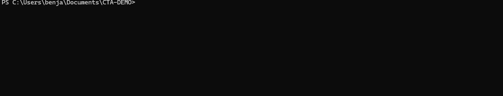
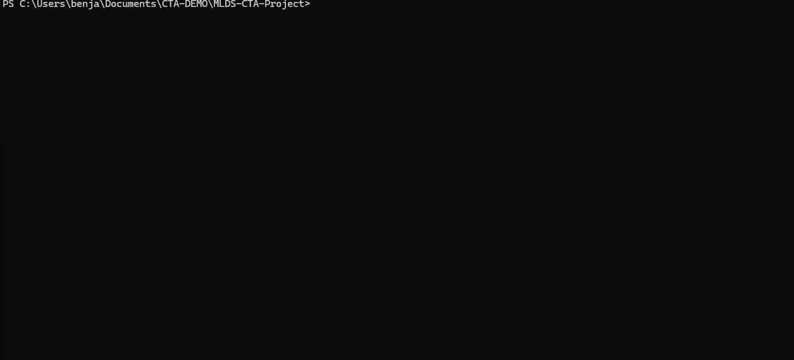
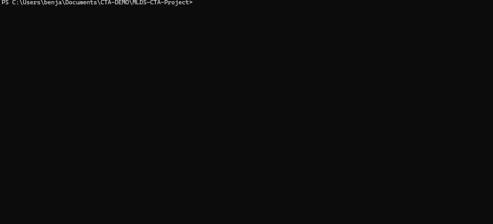
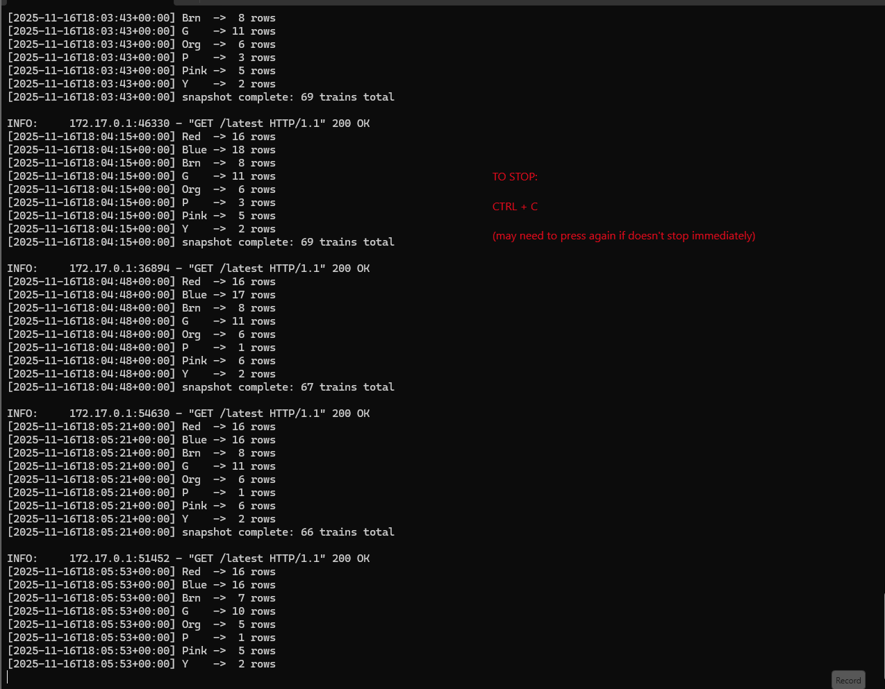

# MLDS-CTA-Project
Real-time animated map of every CTA train in Chicago, powered by the CTA Train Tracker API, FastAPI, SQLite, Leaflet.js, and Docker.

This project continuously polls the CTA API, stores train positions in a SQLite database, and serves a live-updating, smoothly animated map showing each train moving along its route.

# Features

- Live polling of all CTA rail lines (Red, Blue, Brn, G, Org, P, Pink, Y)
- Smooth client-side interpolated animation between API updates
- SQLite database storing historical train positions
- FastAPI backend serving live data
- Leaflet.js front-end map with color-coded train markers
- Dockerized for universal, repeatable deployment
- Fully automatic background train data extraction

# Project Structure
```
MLDS-CTA-Project/
├── assets/ # Gifs used in the README are stored here
│
├── shape_files/ # files with geographic information on train track locations
│
├── scripts/
│   ├── make_cta_routes_json.py # converts shape files to json for usability
│
├── src/
│   ├── extract_data.py        # Polls CTA API & stores positions into SQLite
│   ├── server_fastapi.py      # FastAPI server + /latest endpoint
│   └── .gitkeep
│
├── entrypoint.sh              # Starts extractor + API server inside container
├── Dockerfile                 # Container build configuration
├── requirements.txt           # Python dependencies
├── index.html                 # Interactive Leaflet map
├── cta_routes.json            # Json with Info of Track Coordiantes
├── CODEOWNERS                 # Collaboration rules
└── README.md                  # You're reading this
```

# Requirements

### Git
```
Windows: https://git-scm.com/download/win

macOS: https://git-scm.com/download/mac

Linux: https://git-scm.com/download/linux
```

### Docker Desktop
```
Windows: https://docs.docker.com/desktop/install/windows-install/

macOS: https://docs.docker.com/desktop/install/mac-install/

Linux: https://docs.docker.com/engine/install/
```
### A CTA Train Tracker API key
Get one here:
```
https://www.transitchicago.com/developers/traintracker/
```
# Clone the Repo

Run this where you want this project to be stored on your local machine:
```
git clone https://github.com/Ben-Maisel/MLDS-CTA-Project.git
```

# Build the Docker image

**Make Sure Docker is Running on Your Machine**
Run this in the project root folder (same directory as your Dockerfile):
```
docker build -t cta-tracker .
```
you must be in the right directory for this to work. If you are confused where you should be running this command, refer to the GIF

# Run the container

Run this command right after buiding the image in the same location:
```
docker run -e CTA_TRAIN_API_KEY="YOUR_API_KEY" -e CTA_DB_PATH="/app/cta_trains.db" -p 8000:8000 cta-tracker
```
Use your API KEY

This starts:

1. extract_data.py in the background
2. server_fastapi.py serving the API + map

You should see log output like:
```
Starting extract_data.py (CTA data logger)…
Starting FastAPI server on 0.0.0.0:8000…
```

# View the live CTA map

In your browser, go to:
```
http://localhost:8000
```
(or just click the link in this README)

You’ll see:

Chicago map

Every train as a colored dot

Smooth motion between updates

Popups showing speed, heading, next station, delayed status, etc.

# Stopping the container

Press CTRL+C in the terminal.

Or stop all containers:
```
docker stop $(docker ps -q)
```

# Troubleshooting

### Port 8000 already allocated
If you see:
```
Bind for 0.0.0.0:8000 failed: port is already allocated
```
It means something else (usually another CTA container) is still running.

TO FIX RUN:
```
docker stop $(docker ps -q)
```
### exec format error (entrypoint.sh)
If you ever see:
```
exec /app/entrypoint.sh: exec format error
```
Fix by converting the file to Unix LF in VS Code:
Bottom-right corner → CRLF → LF

### FastAPI loads but no trains show
Make sure your key is correct:
```
echo $CTA_TRAIN_API_KEY
```
Or test directly:
```
https://lapi.transitchicago.com/api/1.0/ttpositions.aspx?key=YOUR_KEY&rt=red&outputType=JSON
```